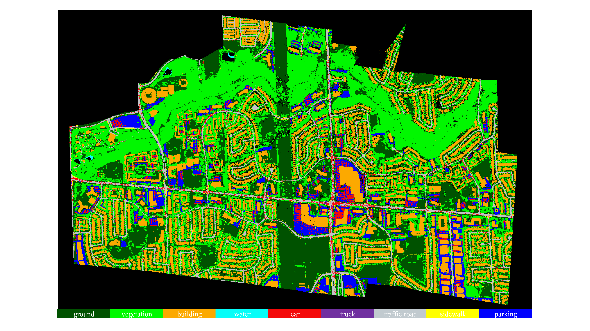

# YUTO: A Large Scale Aerial LiDAR Data Set for Semantic Segmentation
This is the official repository of the **YUTO Semantic** dataset.

### Overview

  

YUTO Semantic is a multi-mission large-scale aerial LiDAR dataset specifically designed for 3D point cloud semantic segmentation. The dataset comprises approximately 738 million points, covering an area of 9.46 square kilometers of York University Campus in Toronto, Ontario Canada.  Each point in the dataset is annotated with one of nine semantic classes.

  

At this time, we are releasing one mission, Galaxy 2018 Fall. We are planning to release the rest of the missions. Details of the dataset can be found in ISPRS GSW 2023.

### Available Classes
* Ground: This class includes unpaved surfaces, grass, and natural terrain.
* Vegetation: This class encompasses trees, bushes, and other forms of vegetation.
* Building: This class represents both commercial and residential buildings.
* Water: This class includes bodies of water such as lakes and rivers.
* Car: This class includes all types of vehicles except for commercial trucks.
* Truck: This class specifically represents commercial trucks.
* Traffic Road: This class corresponds to vehicle roads.
* Sidewalk: This class represents pedestrian walkways.
* Parking: This class represents parking lots.

### Available Attributes
* x, y, z: The position coordinates of each point recorded in UTM zone 17N using the NAD83 horizontal datum.
* Intensity: The normalized LiDAR intensity value of each point, ranging from 0 to 255.
* Number of Return: The number of times the laser pulse was reflected back.
* GPS time: The GPS time of each point, providing temporal information about the data acquisition.
* Scan Angle: The scan angle of each point, indicating the angle at which the laser beam hit the target.
* Class: The label assigned to each point, representing the semantic class or category of the object or surface the point belongs to.

### Semantic Segmentation Results
New results will be updated.

| Method          | OA     | mIoU   | ground   | vegetaion | building | water | car | truck   | traffic road    | sidewalk  | parking |
|------------------|--------|--------|--------|----------|---------|----------|-----------|--------|--------|--------|--------|
|RandLA (Hu et al., 2020)| 84.19| 58.37| 80.61| 94.44| 95.39| 3.34| 74.59| 13.87| 78.10| 23.43| 61.56|
|KPConv (Thomas et al., 2019)| 85.22| 56.14| 86.94| 96.25| 94.01| 0.00| 84.02| 0.00| 79.93| 3.26| 60.83|
|EyeNet (Yoo et al., 2023)| 87.41| 63.44| 86.26| 95.94| 96.78| 13.61| 83.02| 14.26| 84.65| 31.08| 65.34|

### Downloads
Coming Soon! We will upload the downloading link by the end of September!

### Citation
Coming soon

### Acknowledgements
This data set is collected with Teledyne Optech's Galaxy LiDAR.

### To DO List
* Sharing downloading link.
* Adding citation.
* Uploading training code.
* releasing rest of missions.
